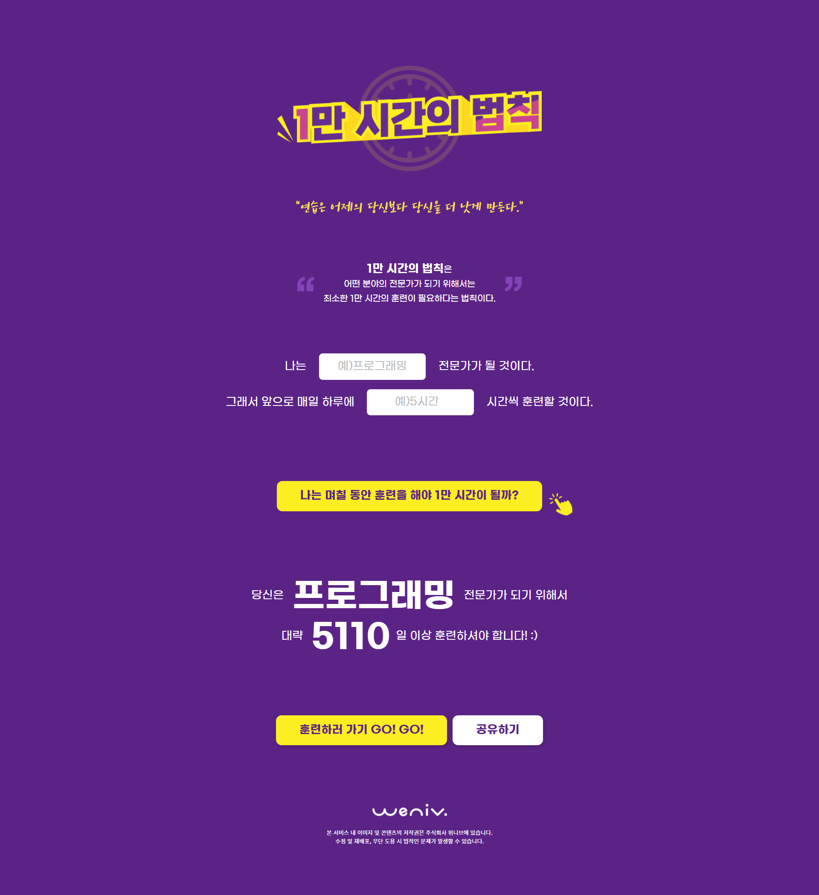

# 📘 1만 시간의 법칙 계산기

> **"연습은 어제의 당신보다 당신을 더 낫게 만든다."**  
> 하루 훈련 시간을 입력하면 1만 시간을 채우기 위해 필요한 일수를 계산해주는 랜딩 페이지입니다.

---

## 🖥️ 데모

[👉 데모 페이지 보러가기](https://cheul-95.github.io/estcamp-10000-hour-rule/)  

---

## 🧩 기술 스택

- HTML5 + CSS3 + JS

---

## 📸 화면 구성 미리보기

<table align="center">
  <tr>
    <th align="center">💻 데스크탑 화면</th>
    <th align="center">📱 모바일 화면</th>
  </tr>
  <tr>
    <td align="center" valign="top">
      
    </td>
    <td align="center" valign="top">
      
    </td>
  </tr>
</table>

---

## 📁 프로젝트 구조

```
estcamp-10000-hour-rule/
├── css/
│ ├── reset.css # 브라우저 스타일 초기화
│ └── style.css # 페이지 스타일 정의
├── font/ # 모든 폰트 리소스
├── img/ # 모든 이미지 리소스
├── index.html # 메인 HTML 페이지
└── README.md # 프로젝트 설명 문서
```

---

## 🔍 시맨틱 마크업 구조 및 특징

<table>
  <thead>
    <tr>
      <th>태그</th>
      <th>적용 예시</th>
      <th>장점</th>
    </tr>
  </thead>
  <tbody>
    <tr>
      <td><code>&lt;header&gt;</code>, <code>&lt;main&gt;</code>, <code>&lt;footer&gt;</code></td>
      <td>페이지 기본 구조 분리</td>
      <td>스크린 리더, SEO 최적화</td>
    </tr>
    <tr>
      <td><code>&lt;section&gt;</code></td>
      <td>quote / input / result / modal</td>
      <td>정보 블록 논리적 구획</td>
    </tr>
    <tr>
      <td><code>&lt;blockquote&gt;</code></td>
      <td>인용문 처리</td>
      <td>의미성과 가독성이 향상</td>
    </tr>
    <tr>
      <td><code>&lt;fieldset&gt;</code>, <code>&lt;legend&gt;</code></td>
      <td>입력 그룹 구분</td>
      <td>확장성을 고려한 그룹화</td>
    </tr>
    <tr>
      <td><code>&lt;picture&gt;</code>, <code>&lt;source&gt;</code></td>
      <td>반응형 이미지 처리</td>
      <td>다양한 해상도 대응</td>
    </tr>
    <tr>
      <td><code>&lt;clamp&gt;</code></td>
      <td>clamp( 최솟값 , calc((최댓값 / 화면크기) * 100vw),최댓값)</td>
      <td>반응형 폰트 사이즈 대응</td>
    </tr>
    <tr>
      <td><code>&lt;small&gt;</code></td>
      <td>부가적인 법적 안내</td>
      <td>부가적인 설명임을 명확히 표현</td>
    </tr>
    </tbody>
</table>

---

## 📌 주요 특징

✅ HTML + CSS + JS 

✅ 다이얼로그(모달) 기능

✅ 반응형 디자인
  - Desktop: max-width: 1280px
  - Mobile: max-width: 720px
    
✅ 접근성 향상 요소
  - label, aria-label, alt, aria-hidden 등을 적절히 활용
  
✅ 검색엔진 최적화(SEO)
  - meta 태그: description, keywords, author 설정

✅ CSS 네이밍 방식
  - BEM(Block Element Modifier) 방식 적용
  - 유지보수성과 코드 가독성 개선 

---

## 📝 피드백 반영 사항

- h1의 img alt값 : 텍스트 이미지이거나 로고와 같이 기업, 브랜드 자체를 표현하는 경우에는 '로고'라는 텍스트는 생략 ( 반영 완료 )
- 크게 의미가 있지 않은 꾸밈을 위한 이미지는 태그를 사용하기 보다는 가상 요소 또는 background를 사용해서 css로 처리 ( 반영 완료 )
- 모달 width를 800px로 설정 - width calc(100% - (여백)), max-width 800px로 하는게 화면 너비에 유연하게 반응예상 ( 반영 완료 )
- 5시간 부분에 숫자만 입력되게 할 것 같습니다. ( 반영 완료 )

---

## 🙋‍♀️ 제작자

- SC LEE  
- GitHub: [@cheul-95](https://github.com/cheul-95)

